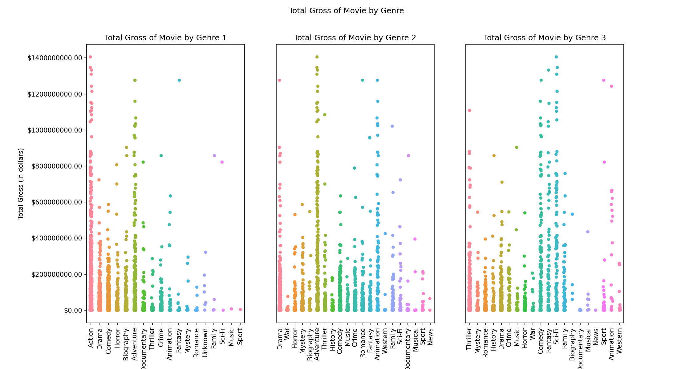
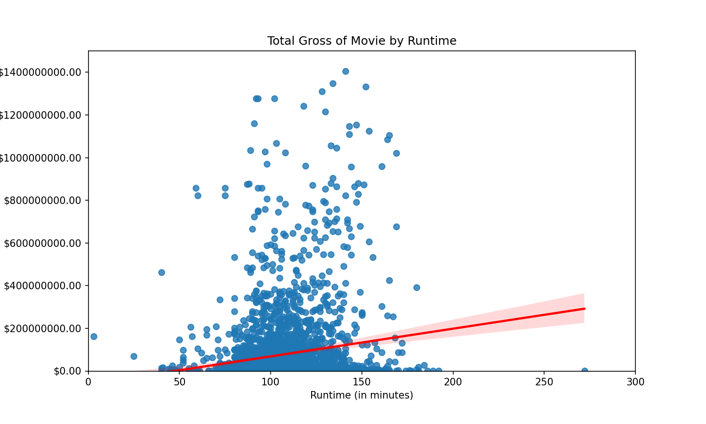
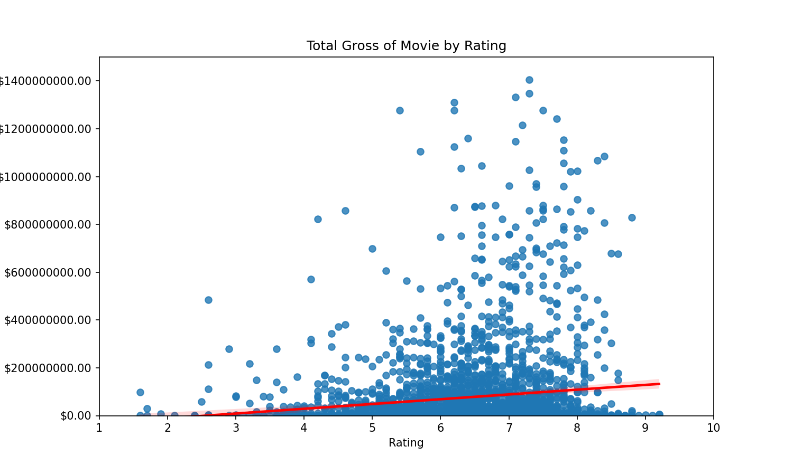

# Microsoft Movie Studios Analysis

**Authors**: Peder Norr

## Overview

***

This proposal contains an analysis of various movie data in order to inform executive decision making regarding Microsoft's hypothetical newly launched movie studio. Specifically, it provides actionable insights with respect to what types of films the studio should focus on creating with the goal of maximizing box office performance. Initial descriptive analysis of box office performance and other movie data shows that box office earnings are related to genre, runtime, and rating. Microsoft can use this analysis to create high performing films and cement their new studio as a profitable and competitive organization in Hollywood.


## Business Problem

***
After witnessing the explosive growth of in house content creation from the likes of Netflix and Amazon, Microsoft has decided to enter the market and create a new movie studio. However, Microsoft is not well versed in the art of film production, and needs information on what types of films perform best at the box office. Using movie genre, movie runtime, and movie rating data, I identify patterns in box office performance to inform Microsoft's decision making as to what types of movies to produce in order to maximize profits.


## Data

***
This analysis leverages data sourced from IMDB and Box Office Mojo, two of the most prominent movie related databases. Data sourced from IMDB included information on movie title, genre, runtime and rating, and data from Box Office Mojo included information on box office gross earnings. The variables from IMDB describe important movie characteristics that can impact a movie's performance at the box office.

While the data will provide insight on movie box office performance, they do have limitations. Including more data, for example data on MPAA ratings, movie budgets, distribution location, release date, actors, directors, and more, could provide much more detailed insight into how to produce profitable movies.


## Methods

***
This project utilizes descriptive analysis, including examination of correlation and relationship among variables. This provides insight for Microsoft into what characteristics of a movie can lead to higher box office earnings.


## Results

***
The descriptive analysis rendered three key insights:

### Certain genres have positive relationships with box office performance

<<<<<<< HEAD


### There is a positive relationship between runtime and box office performance, but there are diminishing marginal returns after 150 minutes



### There is a positive relationship between rating and box office performance


=======


### There is a positive relationship between runtime and box office performance, but there are diminishing marginal returns after 150 minutes


### There is a positive relationship between rating and box office performance


>>>>>>> 0385998939961a1d66e07a45c0d0eeece16e7d79

## Conclusions

***
This analysis provides three recommendations for Microsoft's new movie studio regarding how to decide what type of movies to produce:
* __Make movies of the highest grossing genres__. The movies that could be categorized in the action, adventure, animation, comedy, fantasy, and sci-fi genres tended to have higher box office earnings. Microsoft should focus on these genres the most.
* __Runtime should not be overlooked__. In general, movies that had longer runtimes also had higher box office earnings. However, once movies surpassed a runtime threshold, box office performance was hampered. Microsoft should focus on making movies within that sweet spot between 90 and 150 minutes.
* __Ratings are everything__. The data showed that the movies with the higher ratings tended to have higher box office earnings. Microsoft should prioritize making quality, well reviewed movies that can score at least a 6 on IMDb's scale.


## For More Information

<<<<<<< HEAD
Please review my full analysis in [my Jupyter Notebook](./microsoft_movie_studios_analysis.ipynb) or my [presentation](./microsoft_movie_studios_deck.pdf).
=======
Please review our full analysis in [my Jupyter Notebook](./dsc-phase1-project-template.ipynb) or my [presentation](./DS_Project_Presentation.pdf).
>>>>>>> 0385998939961a1d66e07a45c0d0eeece16e7d79

For any additional questions, please contact Peder Norr at <norr.peder@gmail.com>

## Repository Structure

<<<<<<< HEAD
=======
Describe the structure of your repository and its contents, for example:

>>>>>>> 0385998939961a1d66e07a45c0d0eeece16e7d79
```
├── README.md                           <- The top-level README for reviewers of this project
├── microsoft_movie_studios_analysis.ipynb   <- Narrative documentation of analysis in Jupyter notebook
├── microsoft_movie_studios_deck.pdf         <- PDF version of project presentation
<<<<<<< HEAD
├── data                                <- Both sourced externally and generated from code
=======
├── zippedData                                <- Both sourced externally and generated from code
>>>>>>> 0385998939961a1d66e07a45c0d0eeece16e7d79
└── images                              <- Both sourced externally and generated from code
```
